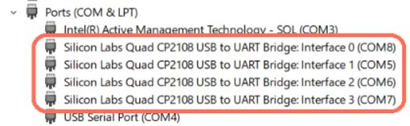

# XPLR-IOT-1-software
This project is intented to be used with the XPLR-IOT-1 device from u-blox. Sensor Aggregation use case v0.2 is compatible with XPLR-IOT-1-00 (PCB Rev B version). More information about XPLR-IOT-1 hardware etc. can be found in the following link: [XPLR-IOT-1 quick start guide](https://developer.thingstream.io/guides/iot-communication-as-a-service/hardware/xplr-iot-1-quick-start-guide) 

XPLR-IOT-1 comes pre-flashed with the Sensor Aggregation Firmware (v0.2) along with a Serial Bootloader that allows firmware on the device to be updated without the need of a debugger/programmer.

This project contains the Sensor Aggregation Use Case example for XPLR-IOT-1 and future updates of this application will be uploaded here.

The main function of this use case is to collect information from sensors and send their data to the [Thingstream](https://portal.thingstream.io/?returnUrl=%2Fapp%2Fcommunication-services%2Fthings) platform using either [WiFi](./src/ublox_modules/wifi) or [Cellular](./src/ublox_modules/cell) Network connections.

The user can enable this functionality with the single press of a [button](./src/buttons_leds). However, if the user wants to experiment with the device and the firmware, [commands](./src/shell_cmd) are provided so that the user can configure the device, test its functionality, and customize its operation.

One of the major aspects of the firmware is that it uses [ubxlib](https://github.com/u-blox/ubxlib) library as much as possible to implement its functionality (see [here](./ubxlib_priv)).

**This project is considered to be used as an *example* and not as a final product code.**


# Description
The main function of this use case is to collect information from sensors and send their data to the Thingstream platform using either [WiFi](./src/ublox_modules/wifi) or [Cellular](./src/ublox_modules/cell) Network connections.

The main features of the application are:
* 1. [Uart shell](./src/shell_cmd). The user can use a UART terminal to get log messages and send commands to the device
* 2. Two main modes of operation:
  * 2.1. [**Sensor Aggregation Main Functionality:**](./src) Samples all sensors with same update period (including position from MAXM10S module) and sends data in Thingstream platform in 2 ways (and one partly supported):
    * 2.1.1. Using [**Wi-Fi**](./src/ublox_modules/wifi) networks and [**MQTT Now**](./src/ublox_modules/wifi) data plan in Thingstream
    * 2.1.2. Using [**Cellular**](./src/ublox_modules/cell/) networks and [**MQTT Anywhere**](./src/ublox_modules/cell/) data plan in Thingstream (using the embedded Thingstream SIM card in XPLR-IOT-1 wherever this is supported)
    * 2.1.3. (Only partly supported) Using [**Cellular**](./src/ublox_modules/cell/) networks and [**MQTT Flex**](./src/ublox_modules/cell/) data plan in Thingstream (the user should setup SARA-R5 module with his own SIM card first)
  * 2.2. [**Sensor Aggregation custom functionality:**](./src) The user can setup the device to enable/ disable various sensors, publish or not publish their data and have different sampling rate for each sensor.The options for sending data to Thingstream are the same as in Sensor Aggregation Main Functionality.
* 3. Simple [button](./src/buttons_leds) activation/deactivation of the Sensor Aggregation Main Functionality
* 4. [LED](./src/buttons_leds) indication of the Sensor Aggregation Main Functionality
* 5. Allow handling of [ublox modules](./src/ublox_modules) via s-center, m-center, u-center by configuring their UARTs properly. Power up/down u-blox modules.
* 6. Control Log messages

The messages sent to Thingstream are compatible with pre-built flows which allow the use of user-hosted dashboard examples using Node Red

More information on the functionality is provided in Readmes at the respective [source code](./src) folders


#	Programming/Building the firmware
The XPLR-IOT-1 comes pre-programmed with the Sensor Aggregation firmware along with a Serial Bootloader to allow firmware updates without the use of a J-Link programmer/debugger.

The example is build using **nRF Connect SDK version 1.7.0** and is advised to use this version to build the project in this repository.

### Building  the firmware
The firmware is based on Nordic’s nRF Connect SDK in a Zephyr RTOS environment. To be able to build it nRF Connect SDK should be installed in your PC (this will also install some necessary tools such as west). 

The nRF Connect SDK version used in Sensor Aggregation firmware is 1.7.0 so this is the recommended version. Newer or older versions could produce errors during compilation.

The current version of Sensor Aggregation firmware relies on a customized version of ubxlib ( a u-blox library publicly available, which makes the handling of u-blox modules easier). That is why this customized ubxlib version is also included in the project in a folder called [ubxlib_priv](./ubxlib_priv). Code in this folder is not supposed to be changed
.
After installing **nRF Connect SDK** the path of the zephyr folder should be included in your system’s environmental variables as **ZEPHYR_BASE** (this is used by the project to build the firmware. If you use VS code to build the project you may not need to perform this step). Help instaliing nRF Connect can be found in Nordic's help pages like: [SDK installation](https://www.youtube.com/watch?v=2cv_jjqk5hg) and [Creating an application](https://www.youtube.com/watch?v=KwJtcPZHV30) 

After setting this environmental variable to your system and if the nRF Connect SDK has been installed properly you should be able to build the firmware. You can do that by:
-	**Recommended:** Using VS code and build as a normal project (see Nordic help pages like [this](https://www.youtube.com/watch?v=3yi6kuxgdPg))
-	Using west commands in a command line (should install west properly to be able to use that):
--	Open a command line or powershell in the project’s folder (the one which contains the ubxlib_priv folder and CMakeLists.txt file) and type the following command:
```
west build -p auto -b nrf5340dk_nrf5340_cpuapp --build-dir .\build .
```
There are three options to compile the project:
1. [Compile a simple image](./compile_options/simple_hex) 
1. [Complile an updetable image](./compile_options/updateable_image)
1. [Compile the application along with the bootloader](./compile_options/bootloader_inclusion)

More information about this can be found in the [compile_options](./compile_options) folder.
Depending on the configuration, a different file can be used from the resulting build folder to program the device. (see the respective Readmes in compile_options folder).

### Programming the firmware using a J-Link debugger

XPLR-IOT-1 can be programmed using a J-Link debugger. There are various options to do that.
1.	Using VS code after you have successfully built the firmware you can program the device using the Flash button


2.	If you have [nrfjprog tools](https://www.nordicsemi.com/Products/Development-tools/nRF-Command-Line-Tools) installed, you can use commands in a command line to program the device:
```	
nrfjprog  --eraseall
nrfjprog --program zephyr.hex --coprocessor CP_APPLICATION (where **zephyr.hex** is the appropriate hex file and also contains the filepath if necessary)
nrfjprog –reset
```
3.	The device can be programmed using [Nordic’s nRF Connect for Desktop](https://www.nordicsemi.com/Products/Development-tools/nRF-Connect-for-desktop) and more specifically the *Programmer app*. The device should be reset after programming.


### Programming the firmware using the Serial Bootloader
XPLR-IOT-1 comes pre-flashed with a Serial Bootloader. This allows the device to be updated without the need of a programmer/debugger. If you erase the device, you need to re-program the bootloader in order to be able to use it (see [here](./compile_options/bootloader_inclusion))

In order to update the device using the Serial Bootloader it must be compiled using option 2 [compile an updateable image](./compile_options/updateable_image) from compile options.

- In order to update the firmware:

	-- Reset the device while holding button 1. Release button 1 about one second after the device resets
	  (reset can be done either by pressing the device reset button, or by turning the device off and on while pressing button 1)

	-- Send the necessary command in a command terminal to update the device. UART should be free (not used by another serial terminal while the command is sent). The necessary command is given below.

The Serial Interface to be used is interface 0. Please find the correct COM port number for your setup (in this case COM8) and use it in the command that follows




In order to send the necessary command for update you need newtmgr.exe (find it in the [tools](./tools) folder):
```
newtmgr.exe --conntype serial --connstring "COM8,baud=115200" image upload app_update.bin
```
Then reset the device or use the command:
```
nrfjprog --reset
```
**Side Note:** This application currently makes use of the APPLICATION core of NORA-B1 in XPLR-IOT-1. If you want to program the NET core also, you can use a similar command like the one provided here (using the appropriate file). In this case when you have NET core and APPLICATION core updates, please program the NET core first, then the APPLICATION core using two separate commands, and then reset the device.


## Disclaimer
Copyright &copy; u-blox 

u-blox reserves all rights in this deliverable (documentation, software, etc.,
hereafter “Deliverable”). 

u-blox grants you the right to use, copy, modify and distribute the
Deliverable provided hereunder for any purpose without fee.

THIS DELIVERABLE IS BEING PROVIDED "AS IS", WITHOUT ANY EXPRESS OR IMPLIED
WARRANTY. IN PARTICULAR, NEITHER THE AUTHOR NOR U-BLOX MAKES ANY
REPRESENTATION OR WARRANTY OF ANY KIND CONCERNING THE MERCHANTABILITY OF THIS
DELIVERABLE OR ITS FITNESS FOR ANY PARTICULAR PURPOSE.

In case you provide us a feedback or make a contribution in the form of a
further development of the Deliverable (“Contribution”), u-blox will have the
same rights as granted to you, namely to use, copy, modify and distribute the
Contribution provided to us for any purpose without fee.

  

