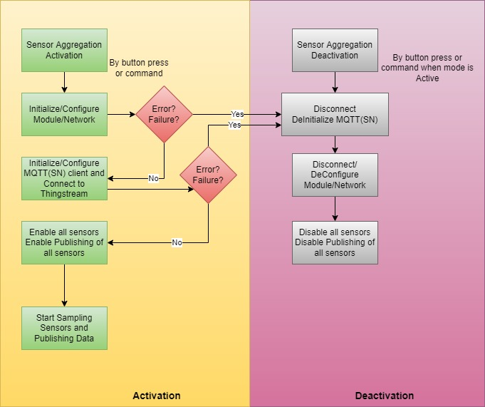

# Description
The firmware provides two main modes of operation:
* 1.Sensor Aggregation Main Functionality:
  * Wi-Fi
  * Cellular
* 2.Sensor Aggregation Custom Functionality

The first mode is an easy way to send all sensor data in Thningstream. Only some initial configuration in needed (see [wifi](./ublox_modules/wifi)) and then with a simple command or button press the device performs all necessary actions.

The second mode allows for more flexibility and the user can experiment with the XPLR-IOT-1. It is also useful to understand how the application and the libraries used work.

## Sensor Aggregation Main Functionality

##### General Functionality Description
This is the main function of the sensor aggregation firmware. In this mode the device will
- Connect to a Wi-Fi or Cellular network
- Establish up MQTT or MQTT-SN connection to the Thingstream platform 
- Enable all sensors
- Publish sensor data through a single aggregate message topic 
- A common sampling period is set for all sensors 
- The sampling period can be configured with the appropriate shell command when the mode is not active

In this mode all sensor data are published in a single message at a single topic (That is why all sensors are forced to have the same sampling period).

##### Failure
If something goes wrong during the setup of this mode (e.g., cannot connect to network or Thingstream platform) the device will reverse any configuration made up to this point (e.g., close Wi-Fi, deinitialize modules etc.) and will exit the mode. In case of failure during the configuration, the mode exits and the user has to explicitly activate the mode again (the device does not try to connect again, automatically).



###	Sensor Aggregation Main Functionality, Wi-Fi
##### Prerequisites
To successfully use the Sensor Aggregation Main function over Wi-Fi some steps are required to configure a Wi-Fi connection and MQTT Now (see [here](./ublox_modules/wifi))
 
##### Usage
As already mentioned, this mode samples all sensors at a certain update period. This period can be set using the command:
```
functions set_period <period in milliseconds>
```
This command should be issued while the sensor aggregation main function is not active, otherwise an error message will appear, and the operation will be rejected.  

The default sampling period if this command is not issued is 20000 milliseconds. The period set with this command is not saved across device resets/power downs.

If the steps mentioned in the prerequisites paragraph have been completed successfully, the Sensor Aggregation Main Function can be controlled in two ways:
-	By using button 1
-	By using shell commands

##### Using Shell Commands
The application can be started with the command: 
```
functions wifi_start 
```
While initializing the LED fades cyan. When the application is ready (Wi-Fi and Thingstream MQTT connection is established) the LED becomes Cyan steadily. That means the sensors are sampled and their data are published to Thingstream.

If application fails to initialize (cannot connect etc.) the LED blinks red 3 times and then the device de-configures the modules used so far automatically. If the user wants to try again, he should send the command again (or use button 1).

While active, the application can be stopped with the command: 
```
functions wifi_stop
```
While stopping, disconnecting and de-configuring the LED fades white (this also holds true if the initialization fails and device de-configures the modules).
##### Using Button 1
The application can also start by [using button 1](./buttons_leds)


###	Sensor Aggregation Main Functionality, Cellular
##### Prerequisites
To successfully use the Sensor Aggregation Main function over Cellular some steps are required to configure a cellular connection and MQTT Anywhere (see [here](./ublox_modules/cell)). [MQTT Flex](./ublox_modules/cell) can also be used
 
##### Usage
As already mentioned, this mode samples all sensors at a certain update period. This period can be set using the command:
```
functions set_period <period in milliseconds>
```
This command should be issued while the sensor aggregation main function is not active (either cell or Wi-Fi), otherwise an error message will appear, and the operation will be rejected. This period applies to both Wi-Fi and cellular functionality.
The default sampling period if this command is not issued is 20000 milliseconds. The period set with this command is not saved across device resets/power downs.
If the steps mentioned in the prerequisites paragraph have been completed successfully, the Sensor Aggregation Main Function can be controlled in two ways:
-	By using button 2
-	By using shell commands

##### Using Shell Commands
The application can be started with the command: 
```
functions cell_start 
```
While initializing the LED fades green. When the application is ready (cellular and Thingstream MQTT-SN connection is established) the LED becomes green steadily. That means the sensors are sampled and their data are published to Thingstream.
If application fails to initialize (cannot connect etc.) the LED blinks red 3 times and then the device de-configures the modules used so far automatically. If the user wants to try again, he should send the command again (or use button 2).

While active, the application can be stopped with the command: 
```
functions cell_stop
```
While stopping, disconnecting and de-configuring the LED fades white (this also holds true if the initialization fails and device de-configures the modules).

##### Using Button 2
The application can also start by [using button 2](./buttons_leds)


