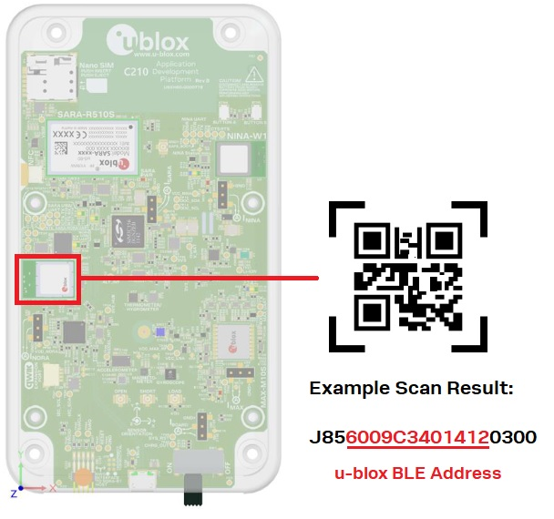
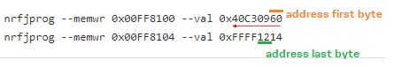

## Important Note for Mobile Application
In the following paragraphs a u-blox mobile application for XPLR-IOT-1 is mentioned. This mobile application can be used with Sensor Aggregation Use Case Example. 

**The u-blox mobile application for XPLR-IOT-1 is not yet available in Android Google Play or iOs App Store, so you cannot access it at the moment.**

**It will be available soon** in both Android and iOS, so make sure to check regularly Google Play, App Store or for notifications in this repository.
When the mobile application is available this note will be removed and instructions on how to access the application in Google Play and App Store will be provided. 


# Bluetooth LE Functionality - Mobile Application Description

### General
Bluetooth LE functionality allows the XPLR-IOT-1 device to connect via Bluetooth LE to u-blox mobile application for Android or iOS.

When using Sensor Aggregation Use Case example for the first time, the XPLR-IOT-1 device needs some input from the user to configure:
-	Wi-Fi connection
-	The MQTT(SN) connection to thingstream

In the firmware the user can use UART terminal commands to provide this input to the device (see [WiFI/MQTTconfig](../wifi/Readme.md) and [MQTTSN Anywhere config](../cell/Readme.md)).

There is an additional option to provide this input, except from UART commands. The user can provide this input wirelessly to the XPLR-IOT-1 using Bluetooth LE.

To do this, a complementary to the Sensor Aggregation Use Case mobile application is provided. The user can connect to XPLR-IOT-1 via Bluetooth LE using this mobile application, and send the necessary commands/information to configure XPLR-IOT-1 properly. The mobile application is available in both Android and iOS devices.

**Note**: At this point MQTT FLex cannot be configured by the mobile application.

For Bluetooth LE shell commands, see [here](../../shell_cmd/Readme.md)


### Bluetooth LE connection/communication
The Bluetooth LE communication between the mobile app and the XPLR-IOT-1 is implemented with a simple Send Command/Receive Response protocol. The protocol itself is defined in [Mobile Application Protocol](./mobile_app_protocol/Readme.md) and is considered independent in the sense that, as long as the API of the protocol module remains the same, the (firmware) application that uses it, should not know any details about the protocol itelf.

The u-blox mobile application connects to XPLR-IOT-1 and then use the **Nordic UART Service (NUS)** to exchange messages (This is UART/Serial Port Emulation over Bluetooth LE). 
The communication between the mobile app and XPLR-IOT-1 is implemented in the form of Bluetooth notifications.

After connection the mobile app obtains a reference to the Bluetooth LE Remote Service with UUID: `6E400001-B5A3-F393-E0A9-E50E24DCCA9E` (This is the NUS: Nordic UART Service) This service has two characteristics:
1. **One Rx Characteristic** with UUID:`6E400002-B5A3-F393-E0A9-E50E24DCCA9E`. This is the characteristic to which the u-blox mobile application writes (sends its messages/commands).
2. **One Tx Characteristic** with UUID:`6E400003-B5A3-F393-E0A9-E50E24DCCA9E`. For this characteristic the notifications are enabled in the mobile app (characteristic Can Notify), so that the mobile app can receive notifications from the XPLR-IOT-1. This is the characteristic to which the XPLR-IOT-1 will send its responses to the mobile app commands.

The way the communication between the two devices is performed is:
- Mobile app sends a command to Rx characteristic
- XPLR-IOT-1 performs the operations asked from the command and responds to Tx characteristic


### Command Handling

As already mentioned the Sensor Aggregation firmware does not know the exact details of the communication protocol between the u-blox mobile application and XPLR-IOT-1. The protocol itself is provided as a separate module with an API (some functions) to use it.

Once the Bluetooth LE connection is estalished between the two devices, any incoming messages from the mobile application, are passed to a command handler (*xBleCmdHandle*). This command handler uses the protocol API to parse the contents of the message received and this API returns the command that should be executed (a list of available commands is given in the form of an enum, by the protocol API) along with any payload data that may come with the command (e.g. a write SSID command should contain the command itself and the actual SSID string in its payload).

After being parsed by the protocol API the command is put in a command execution FIFO. The commands are executed by a Command execution Thread which only runs when the FIFO has commands to be executed.

After the execution of the commands, a response should always be sent back to the mobile app. The sensor aggregation again uses the protocol API to prepare the exact response according to the communication protocol between the two devices, and then sends the response back to the mobile app.


### MTU Setting

To send bigger messages via Nordic UART service as described above, the ATT Maximum Transfer Unit (MTU) setting should be updated/negotiated upon connection to a Bluetooth LE device. This is basically the length of an ATT packet. Maximum MTU setting supported is 247.

Using the mobile application, this is done automatically. You can also use nRF Connect -> Bluetooth Low Energy application to test the Bluetooth LE communication of XPLR-IOT-1. The picture below shows how you can set the MTU setting in this application.


###  Bluetooth device address

nRF Connect SDK (NCS) examples default to using addresses randomly generated at power-up. This address begins with the two most significant bits of 1:1.

U-blox products are provided with public device addresses (in case of XPLR-IOT-1, NORA-B1 handles the Bluetooth LE communication). These addresses are programmed at the factory by u-blox and include an IEEE MAC Address Block Large (MA-L) assignment within its first three least-significant bytes. The three most-significant bytes include a unique assignment for an individual device. 

This address is stored in the User Information Configuration Registers (UICR) and more specifically at the OTP (one time programmable) registers. For more information on this topic please see [application note UBX-19055303](https://content.u-blox.com/sites/default/files/Using-Public-IEEE-Address-From-UICR_AppNote_UBX-19055303.pdf).

Sensor Aggregation use case firmware uses the address assigned by u-blox. If for some reason this address has been deleted (via erasing the entire memory of NORA-B1 with a JLink) then the device defines the Bluetooth LE adress as nRF Connect SDK examples.

#####  Re-program device address
If for some reason this address has been deleted (via erasing the entire memory of NORA-B1 with a JLink) you can find and re-program this address to NORA-B1. You can find instructions on how to do that in [application note UBX-19055303](https://content.u-blox.com/sites/default/files/Using-Public-IEEE-Address-From-UICR_AppNote_UBX-19055303.pdf).

*Below you can find an additional method:*
* You can find the address by scanning the QR-Code of NORA-B1 module by opening your XPLR-IOT-1 device.

* If you have a JLink and Nordic nrf tools installed you can send the following two commands to program the address again in the device registers. (The commands program the address which is shown in the picture above)
```
nrfjprog --memwr 0x00FF8100 --val 0x40C30960
nrfjprog --memwr 0x00FF8104 --val 0xFFFF1214
```
*Note*:  The registers should be 0xFFFFFFFF (erased) to be able to write to them.




###  Command Implementation Notes

The commands described in the [Mobile Application Protocol](./mobile_app_protocol/) are implemented to perform the descibed functionality.

Some command implementations though need some clarification (mostly read commands):
	
* In order to Read the Wi-Fi SSID, a full configuration should be written first. That means:
  * Write the ssid and a sec type with parameter 1 (open network)		
  * Write the ssid, sec type with parameter 2 (password protected) and the password		
  * If you only write the ssid, it will be saved but it will not be read with the read ssid command until a valid configuration (as described in the previous 2 bullets) is present.	
* In order to read the IP Thing Client ID a full configuration should be written first:
  * Write the IP thing client ID, username and password and then you can use the read command to get the client id saved.
  * If you only write the client id, it will be saved but it will not be read with the read client id command until a valid configuration (as described in the previous bullet) is present.
		
* With the erase Thingstream configuration command, you will get a not found response, only if nothing has been saved (no domain, no client id, no password ....). Even if one property has been saved (valid configuration or not) and then deleted with the erase command, you will get the success response.