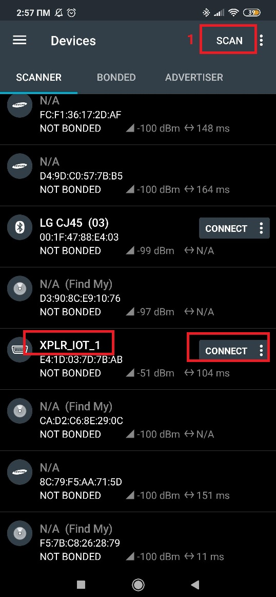
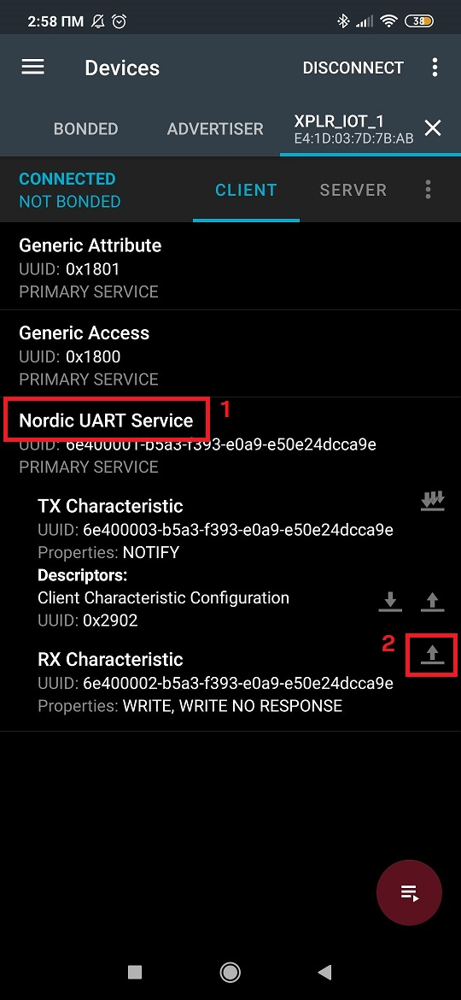
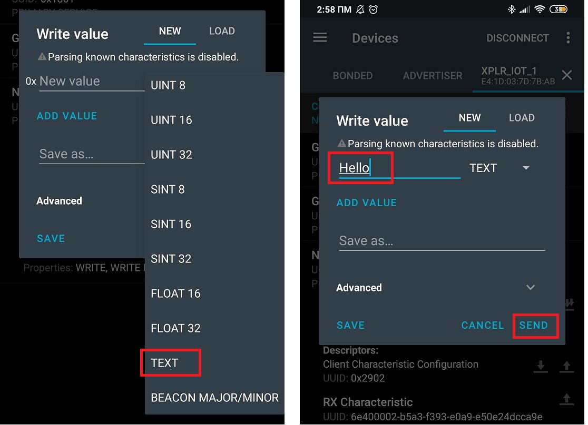
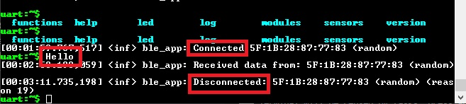
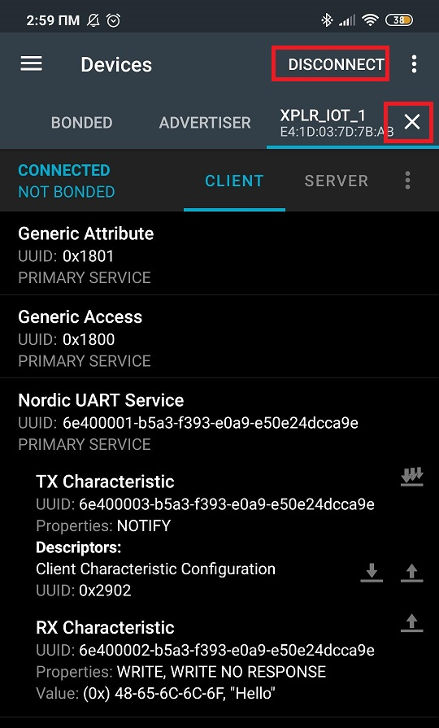

# BLE Functionality Description

BLE functionality is not an essential component of Sensor Aggregation Use Case application. The user can disable/remove it without affecting the rest of the application.

**Note:** Do not remove CONFIG_BT definition from *prog.conf* file when you compile the application along with the bootloader. 

BLE functionality is just added, so the user can test connecting a BLE device to XPLR-IOT-1.

It basically implements [Nordic Uart Service](https://developer.nordicsemi.com/nRF_Connect_SDK/doc/1.5.1/nrf/include/bluetooth/services/nus.html#nus-service-readme) and is based in Nordic's [Bluetooth: Peripheral UART](https://developer.nordicsemi.com/nRF_Connect_SDK/doc/1.5.1/nrf/samples/bluetooth/peripheral_uart/README.html) example. In this modified example, data received from BLE via this Service are typed immediately in the uart console. The user cannot send data from XPLR-IOT-1 to the connected BLE device in currrent implementation.

#### Suggested Usage/Testing

You can test BLE functionality by using [nRF Connect for Mobile](https://play.google.com/store/apps/details?id=no.nordicsemi.android.mcp&hl=el&gl=US) (the instructions are given for android devices, but similar steps can be followed for iOS devices too).

1. Open nRF Connect for Mobile app.
2. Scan for BLE devices and find/connect to your XPLR-IOT-1 device. It should be found under the name "XPLR-IOT-1". Once connected you should see a connection log message in the uart console.

3. In the Device Tab, select the "Nordic Uart Service" and in the expanded menu, select the up arrow near "Rx Characteristic".

4. In the menu that opens, select "Text" for the drop down menu and write the message you want to send. Hit send.

5. The message should be typed in the uart console (not in a log format, but printed instantly)

6. Close the device Tab from nRF Connect mobile app to disconnect. A disconnection log message should appear in the uart console.

