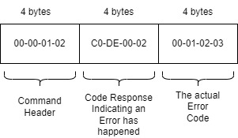

### Important Note for Mobile Application
In the following paragraphs a u-blox mobile application for XPLR-IOT-1 is mentioned. This mobile application can be used with Sensor Aggregation Use Case Example. 

**The u-blox mobile application for XPLR-IOT-1 is not yet available in Android Google Play or iOs App Store, so you cannot access it at the moment.**

**It will be available soon** in both Android and iOS, so make sure to check regularly Google Play, App Store or for notifications in this repository.
When the mobile application is available this note will be removed and instructions on how to access the application in Google Play and App Store will be provided. 


# Bluetooth LE Mobile Application Communication Protocol Module

### Description

This module contains the definition and the API implementing the u-blox mobile application communication protocol via Bluetooth LE. This API is used for the communication between the u-blox mobile application and XPLR-IOT-1 Sensor Aggregation firmware. Changes in the protocol itself are depicted in this moduile alone. 
 
 The protocol files in this folder are independent of the rest of the application and could be used by another firmware by just copying the files (the helper functions defined in *num_array.h* are needed too).
 
 **How it works:**
 - The firmware application takes its commands from whatever source
 - This API parses the commands and returns the result to the application
 - The application performs the necessary actions and uses this API to report results, errors etc.
 - This API takes the input from the application and prepares a response, according to the protocol. It sends back to the API the response byte array
 - The application can then send the response, however it likes.
 
 
 **Usage Example:**
 
 ```
// incoming data are stored in pCmdData and their length is cmdDataSize.

 /*the parsed command will be returned here*/
 mBleProtocolCmd_t command;   
 
/*the payload of parsed command will be returned here*/
 uint8_t CmdPayloadBuf[100];  
 
 /*the payload length will be returned here*/
 uint16_t cmdPayloadLen;      
 
 /* Parse command: */
 mBleProtocolParseCmd( pCmdData, cmdDataSize, &command, gpCmdPayloadBuf, 
                          sizeof( gpCmdPayloadBuf ), &cmdPayloadLen);
 
 /* Execute command: */
 switch(command){
  case READ_FW_VERSION:        error_code = executeReadFwVersionCommand()...
  case GET_MOBILE_APP_VERSION: error_code = executeGetMobileAppVersionCommand...
  case READ_UNIQUE_ID:         ...
  ...
 }
 
 /* Prepare Command Response Code (execution result or error code) */
 mBleProtocolResponseCode_t responseCode;
 if( error_code == SUCCESS){
     responseCode = M_CMD_RSP_OK;
 }
 else{ 
     /*error has happened*/
     responseCode = M_CMD_RSP_ERROR;
 } 
 
 /* Prepare Response payload (if any) */
 mBleProtocolPayload_t payload;
 
 /* In case of error the payload is the actual error code of the application */
 if( error_code != SUCCESS){
     payload.length = 1;
     payload.errorCode = error_code;
 }
 
 /* If operation is successful and needs to send a payload with the response */
 if( error_code == SUCCESS){
    //example response -> firmware version
    payload.length = 2;
    payload.data.fw_version[0] =  FIRMWARE_VERSION_MAJOR;
    payload.data.fw_version[1] =  FIRMWARE_VERSION_MINOR;    
 }
 
 /* if no payload is required in the response (just an ok without any additional data) */
 payload.length = 0;
 
 /* Get the actual response from the protocol module */
 uint16_t responseLen;
 uint8_t ResponseBuffer[100];
 int32_t ret = mBleProtocolPrepareResponse( command, responseCode, payload, ResponseBuffer,
                                            sizeof(ResponseBuffer), &responseLen );
 
 /* send the response via BLE (example application function */
 bt_nus_send( NULL, ResponseBuffer, responseLen);
 ```
 
 
 # Bluetooth LE Mobile Application Communication Protocol v1.0
 
#### Commands Outline

The commands that are implemented are the following:
* Wi-Fi configuration
  *	Write Wi-Fi SSID to XPLR-IOT-1 
  *	Write Wi-Fi Type (open or password is requested) to XPLR-IOT-1
  *	Write Wi-Fi Password to XPLR-IOT-1
  *	Read Wi-Fi SSID from saved configuration in XPLR-IOT-1 
  *	Clear Wi-Fi configuration in XPLR-IOT-1
  *	XPLR-IOT-1 Scan for Wi-Fi networks (implemented by 2 commands: one command to just perform the scan and one to retrieve the results one by one by iterating the command) 


* Thingstream Configuration
  *	Write Thingstream Domain to XPLR-IOT-1 
  *	Write IP Thing Client ID to XPLR-IOT-1 
  *	Write IP Thing Username to XPLR-IOT-1
  *	Write IP Thing Password to XPLR-IOT-1
  *	Write SIM Thing Device ID to XPLR-IOT-1
  *	Read Thingstream Domain from XPLR-IOT-1 
  *	Read IP Thing Client ID from XPLR-IOT-1 
  *	Read SIM Thing Device ID from XPLR-IOT-1
  *	Clear Thingstream configuration


* System Commands:
  *	Read firmware version from XPLR-IOT-1
  *	Send mobile app version to XPLR-IOT-1
  *	Read communication protocol version used in XPLR-IOT-1
  *	Read device unique identifier from XPLR-IOT-1 

####	Command Structure

The commands are recognized by a small 4-byte header in the messages exchanged. For example, mobile app wants to send the SSID of a network, let’s say SSID is “Test” (in hex: 54 65 73 74) and that the command header for “store Wi-Fi” SSID is 00-00-01-02 (hex bytes):
-	The mobile app should send: `00-00-01-02-54-65-73-74`
-	The XPLR-IOT-1 should send a response with the same header plus a result code, like `00-00-01-02-C0-DE-00-01`, where the last 00-01 is the result of the operation.


#####	Unknown Command Response
If the command is not recognized by the XPLR-IOT-1 it will send a response with the same header (first 4 bytes) plus a `0xDEADCODE` hex response.
**Examples:**
> Unknown command without payload 1<br/>
Mobile sends unknown command: `00-23-11-22`<br/>
XPLR-IOT-1 Responds: `00-23-11-22-DE-AD-C0-DE`

>Unknown command without payload 2<br/>
Mobile sends unknown command: `00-23`<br/>
XPLR-IOT-1 Responds: `00-23-DE-AD-C0-DE`

>Unknown command with big payload<br/>
Mobile sends unknown command: `00-23-11-22 – xx- xx -xx-xx-…`<br/>
XPLR-IOT-1 Responds: `00-23-11-22-DE-AD-C0-DE`

##### Operation Error Response

If a command is recognized but an error has happened this is communicated back to the mobile application. The general error response should look like this:

(pic err_response)


The error code itself, (e.g.,00-01-02-03) should be the same as the one used inside the firmware.

##### Commands
| Command                                                       | 4-byte Header + Payload         | Description                                                                                                                   | Response                                                                                                                                                                                                                                                                 | Example                                                                                                                  |
| ------------------------------------------------------------- | ------------------------------- | ----------------------------------------------------------------------------------------------------------------------------- | ------------------------------------------------------------------------------------------------------------------------------------------------------------------------------------------------------------------------------------------------------------------------ | ------------------------------------------------------------------------------------------------------------------------ |
| Clear Wi-Fi configuration                                     | `(0x) 00-00-01-00`                | Without payload. Just send header                                                                                             | `00-00-01-00-C0-DE-00-00` : Config Cleared (success)<br>`00-00-01-00-C0-DE-00-01`: No Config Found (success)<br>`00-00-01-00-C0-DE-00-02-XX-XX-XX-XX`: Error (fail)                                                                                                            | Mobile Sends: `00-00-01-00`<br>XPLR-IOT Response: `00-00-01-00-C0-DE-00-00`                                                  |
| Read Wi-Fi SSID from XPLR-IOT-1                                | `(0x) 00-00-01-01`                | Without payload. Just send header                                                                                             | `00-00-01-01-C0-DE-00-00-xx-xx-xx-xx-xx…` : Command is sent ok, xx-xx-xx-xx… are the bytes that contain the SSID-> convert them to ascii<br>`00-00-01-01-C0-DE-00-01`: No saved SSID found<br>`00-00-01-01-C0-DE-00-02-XX-XX-XX-XX`: Error(fail)                               | Mobile Sends: `00-00-01-01`<br>XPLR-IOT Response: `00-00-01-01-C0-DE-00-00-54-65-73-74` (ssid is "test")                     |
| Write Wi-Fi SSID to XPLR-IOT-1                                 | `(0x) 00-00-01-02  -xx-xx-xx-xx…`| Payload xx-xx-xx-xx… contains the SSID string bytes                                                                           | `00-00-01-02-C0-DE-00-00` : Ok<br>`00-00-01-02-C0-DE-00-02-XX-XX-XX-XX`: Error (fail)                                                                                                                                                                                        | Mobile Sends: `00-00-01-02-54-65-73-74` (ssid is "test")<br>XPLR-IOT Response: `00-00-01-02-C0-DE-00-00`                     |
| Write Wi-Fi Type (open or password is requested) to XPLR-IOT-1 | `(0x) 00-00-01-03 -xx`            | Payload xx can be:<br>\-`01` = Open network (no password required)<br>\-`02` = Password required.                                 | `00-00-01-03-C0-DE-00-00` : Ok<br>`00-00-01-03-C0-DE-00-02-XX-XX-XX-XX`: Error (fail)                                                                                                                                                                                        | Mobile Sends: `00-00-01-03-02`<br>XPLR-IOT Response: `00-00-01-03-C0-DE-00-00`                                               |
| Write Wi-Fi Password to XPLR-IOT-1                             | `(0x) 00-00-01-04`                | Payload xx-xx-xx-xx… contains the password string bytes                                                                       | `00-00-01-04-C0-DE-00-00` : Ok<br>`00-00-01-04-C0-DE-00-02-XX-XX-XX-XX`: Error (fail)                                                                                                                                                                                        | Mobile Sends: `00-00-01-04-54-65-73-74` (password is "test")<br>XPLR-IOT Response: `00-00-01-04-C0-DE-00-00`                 |
| Scan available Wi-Fi networks                                  | `(0x) 00-00-01-05` | Without payload. Just send header | `00-00-01-05-C0-DE-00-00-xx-yy-yy...` : Ok<br><br><br>`xx`: (bool) This just indicates if during scanning the max number of results was reached. In this case some results cannot be obtained.<br>0: Some results cannot be obtained<br>1: All results can be obtained<br><br>`yy-yy`: This is the number of networks found(uint16). Refers to results that can be obtained.<br><br>`00-00-01-00-C0-DE-00-01`: No Networks Found (success)<br><br>`00-00-01-05-C0-DE-00-02-XX-XX-XX-XX`: Error (fail)<br><br>This command just issues the command to scan for networks, it does not return the results.  | Mobile Sends: `00-00-01-05`<br><br>XPLR-IOT Response: `00-00-01-05-C0-DE-00-00 - 01 - 00 - 03` ( all results can be obtained : 3 networks found )<br><br>XPLR-IOT Response: `00-00-01-05-C0-DE-00-00 - 00 - 00 - 32` ( not all results can be obtained : 50 networks found )<br><br>Default max number of Results is 50, however this can be changed by the  user in the firmware code.<br><br><br>     |
| Get (Next) Result from "Scan available WiFI networks" command | `(0x) 00-00-01-06` | Without payload. Just send header | `00-00-01-05-C0-DE-00-00-xx-xx-sc-rs-rs-rs-rs-zz-zz...` : Ok<br><br>`xx-xx` ( 2 bytes ): Result number (1,2,3…)(uint16)<br>`sc` (1 byte ): Security Type - 01= No Password Needed, All other values= Password Needed (uint8)<br>`rs-rs-rs-rs` ( 4bytes ): Rssi signal strength (int32\_t)<br>`zz-zz...`: are the bytes that contain the SSID-> convert them to ascii<br><br>`00-00-01-00-C0-DE-00-01`: No Networks Found (success)<br><br>`00-00-01-05-C0-DE-00-02-XX-XX-XX-XX`: Error (fail)<br><br>\- This command should be used AFTER "Scan available WiFI networks" command.<br>\- If "Scan available WiFI networks" returns an error then this command will return the same error<br>\- You should iterate this command to get all results.  E.g. if "Scan available WiFI networks" says there are 10 results, you should send this command 10 times to get all results. Each command returns one result (in an ascending order, 1st result, 2nd result etc)<br>\- If after all results have been obtained, the command is sent again it will respond with a No Networks Found response. | Mobile Sends: `00-00-01-06`<br><br>XPLR-IOT Response: `00-00-01-05-C0-DE-00-00-00-01-01-FF-FF-FF-AA-57-49-4E-44-5F-50-59-64-72-61-62` (1st network result, no password needed, ssid is "WIND\_PYdrab", rssi is: -86)<br><br>Mobile Sends: `00-00-01-06`<br><br>XPLR-IOT Response:`00-00-01-05-C0-DE-00-00-00-02-12-FF-FF-FF-A7-43-4F-53-4D-4F-54-45-20-57-69-46-69-20-46-6F-6E` (2nd network result, password needed, ssid is "COSMOTE WiFi Fon", rssi is: -89)<br><br>Mobile Sends: `00-00-01-06`<br><br>XPLR-IOT Response:`00-00-01-05-C0-DE-00-00-00-03-12-FF-FF-FF-A7-43-4F-53-4D-4F-54-45-2D-30-32-36-36-32-30` (3rd network found of 3,password needed, ssid is "COSMOTE-026620", rssi is: -89) |
| Clear Thingstream configuration                               | `(0x) 00-00-02-00`                | Without payload. Just send header                                                                                             | `00-00-02-00-C0-DE-00-00` : Config Cleared (success)<br>`00-00-02-00-C0-DE-00-01`: No Config Found (success)<br>`00-00-02-00-C0-DE-00-02-XX-XX-XX-XX`: Error (fail)                                                                                                            | Mobile Sends: `00-00-02-00`<br>XPLR-IOT Response: `00-00-02-00-C0-DE-00-00`                                                  |
| Read Thingstream Domain from XPLR-IOT-1                       | `(0x) 00-00-02-01`                | Without payload. Just send header                                                                                             | `00-00-02-01-C0-DE-00-00-xx-xx-xx-xx-xx…` : Command is sent ok, xx-xx-xx-xx… are the bytes that contain the Domain-> convert them to ascii<br>`00-00-02-01-C0-DE-00-01`: No saved Domain found<br>`00-00-02-01-C0-DE-00-02-XX-XX-XX-XX`: Error(fail)                           | Mobile Sends: `00-00-02-01`<br>XPLR-IOT Response: `00-00-02-01-C0-DE-00-00-54-65-73-74` (Domain is "test")                   |
| Read IP Thing Client ID from XPLR-IOT-1                       | `(0x) 00-00-02-02`                | Without payload. Just send header                                                                                             | `00-00-02-02-C0-DE-00-00-xx-xx-xx-xx-xx…` : Command is sent ok, xx-xx-xx-xx… are the bytes that contain the Client ID-> convert them to ascii<br>`00-00-02-02-C0-DE-00-01`: No saved Client ID found<br>`00-00-02-02-C0-DE-00-02-XX-XX-XX-XX`: Error(fail)                     | Mobile Sends: `00-00-02-02`<br>XPLR-IOT Response: `00-00-02-02-C0-DE-00-00-54-65-73-74` (Client ID is "test")                |
| Read SIM Thing Device ID from XPLR-IOT-1                      | `(0x) 00-00-02-03`                | Without payload. Just send header                                                                                             | `00-00-02-03-C0-DE-00-00-xx-xx-xx-xx-xx…` : Command is sent ok, xx-xx-xx-xx… are the bytes that contain the SIM Thing Device ID-> convert them to ascii<br>`00-00-02-03-C0-DE-00-01`: No saved SIM Thing Device ID found<br>`00-00-02-03-C0-DE-00-02-XX-XX-XX-XX`: Error(fail) | Mobile Sends: `00-00-02-03`<br>XPLR-IOT Response: `00-00-02-03-C0-DE-00-00-54-65-73-74` (SIM Thing Device ID is "test")      |
| Write Thingstream Domain to XPLR-IOT-1                        | `(0x) 00-00-02-04  -xx-xx-xx...`  | Payload xx-xx-xx-xx… contains the Thingstream Domain string bytes                                                             | `00-00-02-04-C0-DE-00-00` : Ok<br>`00-00-02-04-C0-DE-00-02-XX-XX-XX-XX`: Error (fail)                                                                                                                                                                                        | Mobile Sends: `00-00-01-02-04`<br>XPLR-IOT Response: `00-00-02-04-C0-DE-00-00`                                               |
| Write IP Thing Client ID to XPLR-IOT-1                        | `(0x) 00-00-02-05 -xx-xx-xx…`     | Payload xx-xx-xx-xx… contains the Client ID string bytes                                                                      | `00-00-02-05-C0-DE-00-00` : Ok<br>`00-00-02-05-C0-DE-00-02-XX-XX-XX-XX`: Error (fail)                                                                                                                                                                                        | Mobile Sends: `00-00-01-02-05`<br>XPLR-IOT Response: `00-00-02-05-C0-DE-00-00`                                          |
| Write IP Thing Username to XPLR-IOT-1                         | `(0x) 00-00-02-06 -xx-xx-xx…`     | Payload xx-xx-xx-xx… contains the Username string bytes                                                                       | `00-00-02-06-C0-DE-00-00` : Ok<br>`00-00-02-06-C0-DE-00-02-XX-XX-XX-XX`: Error (fail)                                                                                                                                                                                        | Mobile Sends: `00-00-01-02-06`<br>XPLR-IOT Response: `00-00-02-06-C0-DE-00-00`                                               |
| Write IP Thing Password to XPLR-IOT-1                         | `(0x) 00-00-02-07 -xx-xx-xx…`     | Payload xx-xx-xx-xx… contains the Password string bytes                                                                       | `00-00-02-07-C0-DE-00-00` : Ok<br>`00-00-02-07-C0-DE-00-02-XX-XX-XX-XX`: Error (fail)                                                                                                                                                                                        | Mobile Sends: `00-00-01-02-07`<br>XPLR-IOT Response: `00-00-02-07-C0-DE-00-00`                                               |
| Write SIM Thing Device ID to XPLR-IOT-1                       | `(0x) 00-00-02-08 -xx-xx-xx…`     | Payload xx-xx-xx-xx… contains the SIM Thing Device ID string bytes                                                            | `00-00-02-08-C0-DE-00-00` : Ok<br>`00-00-02-08-C0-DE-00-02-XX-XX-XX-XX`: Error (fail)                                                                                                                                                                                        | Mobile Sends: `00-00-01-02-08`<br>XPLR-IOT Response: `00-00-02-08-C0-DE-00-00`                                               |
| Read firmware version from XPLR-IOT-1                         | `(0x) 00-00-00-01`                | Without payload. Just send header                                                                                             | `00-00-00-01-C0-DE-00-00-XX-YY` : Command is sent ok, XX: Firmware Major Version (uint8)<br>YY: Firmware Minor Version(uint8)<br>`00-00-00-01-C0-DE-00-02-XX-XX-XX-XX`: Error(fail)                                                                                          | Mobile Sends: `00-00-00-01`<br>XPLR-IOT Response: `00-00-00-01-C0-DE-00-00-00-02` (version is 0.2)                           |
| Send mobile app version to XPLR-IOT-1                         | `(0x) 00-00-00-02 -XX-YY`         | Payload XX-YY contains the mobile app version, XX: Application Major Version (uint8)<br>YY:  Application Minor Version(uint8) | `00-00-02-08-C0-DE-00-00` : Ok<br>`00-00-02-08-C0-DE-00-02-XX-XX-XX-XX`: Error (fail)                                                                                                                                                                                        | Mobile Sends: `00-00-00-02-01-02` (application version 1.2)<br>XPLR-IOT Response: `00-00-00-02-C0-DE-00-00`                  |
| Read device unique identifier from XPLR-IOT-1                 | `(0x) 00-00-00-03`                | Without payload. Just send header                                                                                             | `00-00-00-03-C0-DE-00-xx-xx-xx-xx-xx…` : Command is sent ok, xx-xx-xx-xx… are the bytes that contain the unique device identifier-> convert them to ascii<br>`00-00-02-03-C0-DE-00-02-XX-XX-XX-XX`: Error(fail)                                                              | Mobile Sends: `00-00-00-03`<br>XPLR-IOT Response: `00-00-00-03-C0-DE-00-00-54-65-73-74` (Unique device identifier is "test") |
| Read communication protocol version used in XPLR-IOT-1        | `(0x) 00-00-00-04`                | Without payload. Just send header                                                                                             | `00-00-00-04-C0-DE-00-00-XX-YY` : Command is sent ok, XX: Communication protocol Major Version (uint8)<br>YY: Communication Protocol Minor Version(uint8)<br>`00-00-00-04-C0-DE-00-02-XX-XX-XX-XX`: Error(fail)                                                              | Mobile Sends: `00-00-00-04`<br>XPLR-IOT Response: `00-00-00-04-C0-DE-00-00-01-00` (version is 1.0)                           |


##	Known Limitations

-	The Bluetooth LE communication in this version is not encrypted for simplicity reasons. A future update may provide encryption over the communication between the mobile application and the firmware.
-	The mobile app can support IP things and SIM MQTT anywhere things. MQTT Flex things are more complicated and not supported at the moment.
