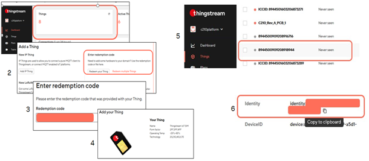
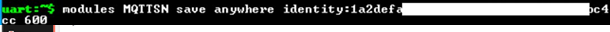
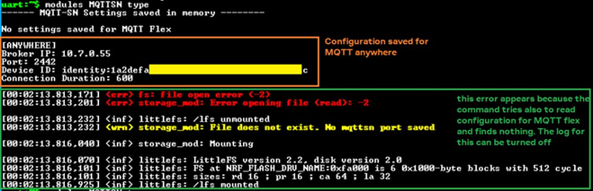
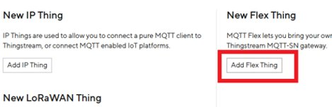
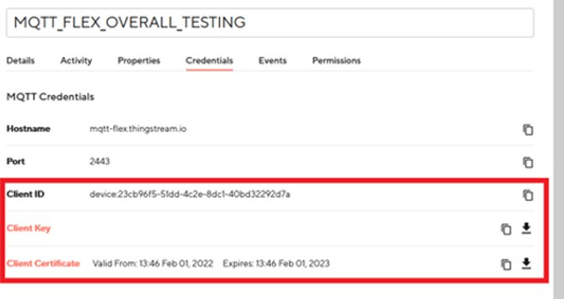
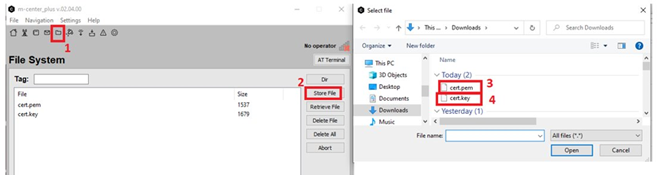
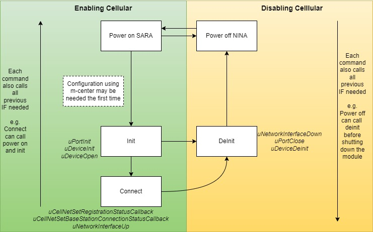
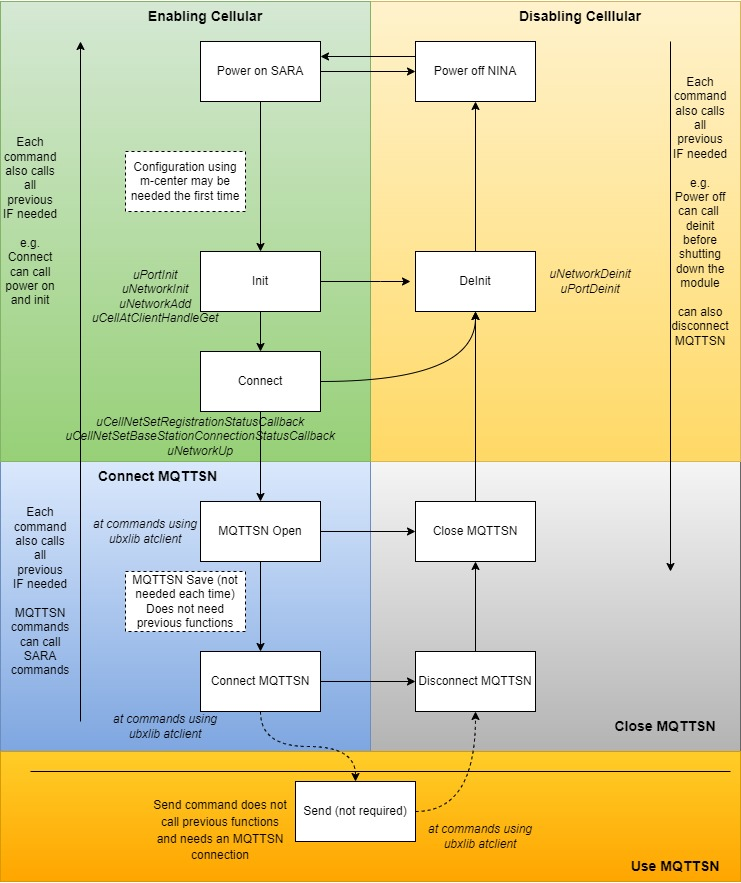

# Configure Cellular
The XPLR-IOT-1 uses the SARA-R5 module to connect to cellular networks.

If the SARA module has not been connected to a mobile network operator successfully before, it may take quite some time to register/connect to a network, when the command to connect is given or the user activates the Sensor Aggregation Main Function via cellular. During this time a lot of Registered/Not Registered messages may appear. This is normal.

If it takes too much time to Register somewhere, then it may be necessary to reset the device (if it does not timeout) and use AT commands to connect the module to a Mobile Network Operator for the first time. Please refer to **SARA-R5 section** of [XPLR-IOT-1 user guide](https://www.u-blox.com/docs/UBX-21035674) for this. In order to be able to use SARA-R5 with u-blox [m-center](https://www.u-blox.com/en/product/m-center) application, or send serial commands directly to it you should send the command:
```
modules SARAR5 power_on
```
By default SARA can connect to m-center after a reset, you just need to select the appropriate serial COM (see [XPLR-IOT-1 hardware manual](https://www.u-blox.com/docs/UBX-21035674)

To power down SARA you can use the command:
```
modules SARAR5 power_off
```

  

**Note:** The firmware is preconfigured to use the MQTT anywhere plan. However, it is possible that its setting is to use MQTT Flex (not using the Thingstream card). You can check the active plan by sending the command:
```
modules SARAR5 plans get_active 
```
If the active plan is not MQTT Anywhere you can set it by sending the command:
```
modules SARAR5 plans anywhere
```


##### Troubleshooting SARA-R5 -- Commands cannot be executed
If commands other than power on/off, seem to be doing nothing, then it is possible that the communication between NORA-B1 and SARA-R5 is not set up properly. SARA-R5 communicates with NORA-B1 with its secondary UART peripheral. The main peripheral is connected to the UART-USB Interface 1 of XPLR-IOT-1 for use with [m-center](https://www.u-blox.com/en/product/m-center) (or some PC terminal). This secondary UART is enabled when you receive your XPLR-IOT-1 device. However if the commands seem like they are doing nothing, it is possible that this secondary UART is not configured properly to communicate with NORA-B1. In order to configure the secondary UART properly again, you need to follow this procedure:

- Send the power on command to SARA-R5: `modules SARAR5 power_on`
- Connect [m-center](https://www.u-blox.com/en/product/m-center) (or some other terminal) to Interface 1 of XPLR-IOT-1 (see **USB connection** of [XPLR-IOT-1 user guide](https://www.u-blox.com/docs/UBX-21035674)).
- Send the following commands:
```
AT+USIO=2
AT+CFUN=16
```
The first command activates the secondary uart of SARA-R5, which is needed in order to establish a communication between SARA-R5 and NORA-B1. Then the module needs to be reset with the second command for the configuration to take effect.

#	Configure MQTT Anywhere
When the user wants to connect to Thingstream via Cellular, using the embedded Thingstream SIM card (eSIM - see [XPLR-IOT-1 - User guide](https://www.u-blox.com/docs/UBX-21035674)), the MQTT Anywhere Plan should be used. The eSIM should be activated in the Thingstream platform using the redemption code provided with XPLR-IOT-1.

After the redemption code is entered, the identity of the device created, should be copied to the XPLR-IOT-1 using the appropriate command. This essentially configures the MQTT-SN client.
The following steps should be performed:
1.	In Thingstream platform: Add a new Thing in Thingstream platform by using the Enter redemption code option
2.	In Thingstream platform: Select the newly created thing in the “Things” menu
3.	In Thingstream platform: Copy the identity of the device (using the copy button)

 

4.	In XPLR-IOT-1 device: Use the following command and paste the device identity copied from the previous step
```
modules MQTTSN save anywhere <Identity> <Connection Duration in seconds>
```			
Connection duration should be greater than sampling period of the sensors.



5.	*Optional:* Use the following command to check if the information is ok
```
modules MQTTSN type
```

 

**Important Note:**  It is better to copy/paste of the credentials, rather than typing them

 # Configure MQTT Flex
If a user wants to connect via Cellular to Thingstream platform using a third party SIM card (nano SIM, see [XPLR-IOT-1 - User guide](https://www.u-blox.com/docs/UBX-21035674)) and not the embedded SIM (eSIM) in the XPLR-IOT-1 device, then the MQTT Flex Plan should be used. Currently, MQTT Flex has been tested only with 1nce SIM cards in NB-IOT networks.

To setup MQTT Flex the user will also need to use m-center. The following steps should be followed:
1.	In Thingstream platform: Create a Flex Thing



2.	In Thingstream platform: Select the Flex thing create and download the client key and certificate from the credentials tab. Also copy the client ID (using the copy button)

  


3.	In XPLR-IOT-1: Reset XPLR-IOT-1 and power up SARA-R5 module by sending the command:
```
modules SARAR5 power_on
```
4.	In host PC: Connect m-center to XPLR-IOT-1 in interface 1 
5.	In host PC : Use m-center File System tab to upload the client key & client certificates into the modem

    


**Important Note:**
The files saved in SARAR5 should have the names:
-	**cert.pem** for the client certificate
-	**cert.key** for the client key
Other filenames won’t work

6.	In XPLR-IOT-1: Power down SARA-R5 module by sending the command:
```
modules SARAR5 power_off
```
7.	In XPLR-IOT-1: Send the following command and paste the id copied from step 2:
```
modules MQTTSN save flex <Client Id>
```
8.	(Optional) In XPLR-IOT-1: check the saved settings with the following command: 
```
modules MQTTSN type command
```
After that you should be ready to connect to Thingstream via Cellular, using a third party SIM card. The flex plan should be activated using the command:
```
modules SARAR5 plans flex
```
Configuration of the cellular module to connect to a Mobile Network Operator should also be performed, before trying to use the sensor aggregation main function.


# Handling Cellular
Cellular is handled via SARAR5 module, so all commands having to do with Cellular connectivity are part of the SARA module.
SARA is handled via the following commands:
-	Power on/off
-	Init/deinit
-	Connect

Power on and off commands have already been discussed (see [here](../Readme.md))


#### Init/Deinit
Init command powers up (if not already powered up), sets up and opens the Cellular device in a ubxlib context so that it is ready to execute a connect command.

Deinit does the exact opposite of init. It disconnects the module if connected and clears ubxlib status so that it can be used by another module if necessary.

#### Connect
If the module has been initialized, the connect command configures the device and connects to a Mobile network operator. Some configuration may be needed the first time the device is used via m-center (see **SARA-R5 section** in [XPLR-IOT-1 user guide](https://www.u-blox.com/docs/UBX-21035674) ). If the init command has not been issued, it is called internally by the connect command.

Providing details about ubxlib usage is out of the scope of this operation, however in the following picture the normal usage flow of the Cellular module is presented and ubxlib functions called inside the calls of these functions are mentioned in italics.



# Handling MQTT-SN
Connection to MQTT-SN can only be achieved if an active Cellular connection is available. MQTT-SN is used via SARAR5 native MQTTSN client and is handled using ubxlib. 
For this reason, MQTTSN module can be considered as part of the cellular module in the sense of Sensor Aggregation Firmware, however is treated as a separate module with its own set of commands. These commands can be accessed by sending:
```
modules MQTTSN <open/close/connect/disconnect etc...>
```
The commands/operations available for MQTT module are:
-	Open/close
-	Connect/Disconnect
-	Save
-	Type
-	Status
-	Send


#### Open/Close
Open command opens MqttSn client in a ubxlib context. Open command requires a connection to Cellular to start its function. If this connection is not available yet, it calls all necessary functions to establish a Cellular connection and if this fails it aborts its operation. In the case of MQTT FLex plan, it also configures the necessary TLS security settings (certificate and private key - see also **Configure MQTT Flex** section in this Readme). 

Close just closes MQTTSN module. To be able to connect to MQTT again after a close command, the open command should be called again.

#### Connect
After MQTTSN open command, the connect command connects to MQTTSN broker. In this application the Broker is set to be Thingstream platform, either via MQTT Anywhere or MQTT Flex plans. At this stage the necessary credentials (such as Client ID etc.) are loaded from memory (you can save those credentials in memory with the `save` command, mentioned below). After connection is established, the device can send messages to the broker and receive messages.

Connect command can call all needed previous commands internally if needed to perform a connection (power up SARA, connect to Mobile network operator, open MQTTSN etc).

 
#### Save and Type
These commands are used to setup MQTTSN client for connection to a broker. See **Configure MQTT Flex** and **Configure MQTT Anywhere** sections for more details.

#### Status
Just types the status of the module. 
 
#### Send
When connected to an MQTTSN broker this command allows you to send a message to a topic using any Quality of Service. 

**Note:** In this firmware version Quality of Service 3 (aka -1) can be used, but not in a Connectionless state. The MQTT Client should be connected to the broker for this to work. This happens because this feature is not direclty supported by ubxlib (you can still use it with small workarounds, but this is out of the scope of this example). This is something that will be fixed in a next update.


The picture below shows how MQTTSN and Cellular module can be used (along with ubxlib functions called)


