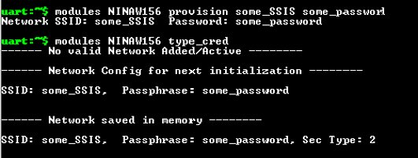
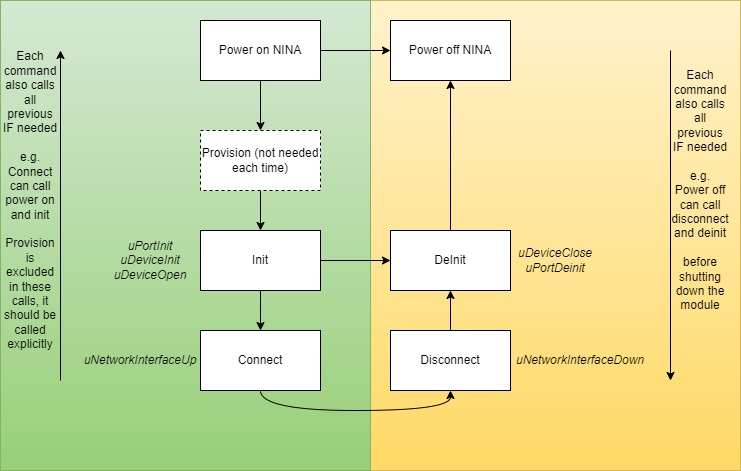
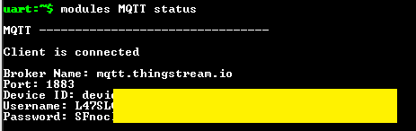
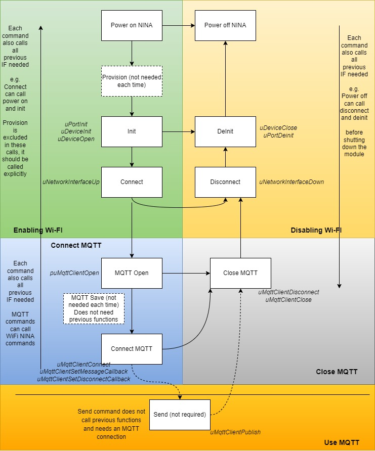

#	Configure Wi-Fi
To be able to use certain Wi-Fi commands which initialize the module and connect to a Wi-Fi network, the credentials of this Wi-Fi network should be provided to the device (this procedure is also called Wi-Fi provisioning). 
Although NINA-W156 which handles the Wi-Fi connections, can also be configured using s-center, in the context of Sensor Aggregation firmware the Wi-Fi network should be configured using the firmware’s commands and not s-center.

To provide the Wi-Fi network credentials (SSID, password) to the device the following command should be used:
```
modules NINAW156 provision <SSID> <Password>
```
After this command is issued the user can check if the information is saved properly using the command: 
```
modules NINAW156 type_cred
```
**Important Note:** It is advised to copy-paste your credentials (SSID, Password) than typing them. You can right click in the terminal to paste in the case of Tera Term. It has been noticed that sometimes, typing the information directly in the terminal may cause data not to be received properly (cannot connect to Wi-Fi network)





#	Configure MQTT Now
When the user wants to connect to Thingstream via Wi-Fi, an MQTT Now plan should be used. The following steps describe what should be done to configure the MQTT client in XPLR-IOT-1 to connect to Thingstream via Wi-FI.
1.	In Thingstream platform: Create an IP thing in Thingstream
2.	In Thingstream platform: Select your Thing in the “Things” menu
3.	In Thingstream platform: From the credentials Tab, copy the Client ID, Username, and password (use the copy button)

 

4.	In XPLR-IOT-1 device: Use the following command and paste the credentials copied from previous step
```
	modules MQTT save <Client ID> <Username> <Password>
```
5.	*(Optional)* In XPLR-IOT-1 device:  Use the following command to check if the information provided in the previous step is correct:
```
	modules MQTT type
```
**Important Note:**  It is better to copy/paste of the credentials, rather than typing them


# Handling Wi-Fi
Wi-Fi is handled via NINAW156 module, so all commands having to do with Wi-Fi are part of the NINA module.
NINA is handled via the following commands:
-	Power on/off
-	Init/deinit
-	Connect/disconnect 
-	provision
-	type_cred

Power on and off commands have already been discussed (see [here](../Readme.md))
Provision and type_cred (type credentials) commands are used to provide information about the Wi-Fi network the user wants to connect to, to the device (see Configure Wi-Fi section)

#### Init/Deinit
Init command initialized the module so that it will be ready to connect to a Wi-Fi network. Initialization includes all operations necessary, such as powering up the module (if not already powered up), reading the memory for saved Wi-Fi network credentials, setting up ubxlib environment for connection etc.

Deinit does the exact opposite of init. It disconnects the module if connected and clears ubxlib status so that it can be used by another module if necessary.

#### Connect/Disconnect

If the module has been initialized the connect command just connects the module to the Wi-Fi network provided with the provision command. If the init command has not been issued, it is called internally by the connect command.

Disconnect, just disconnects the module from the network (does not perform any deinitialization actions).


Providing details about ubxlib usage is out of the scope of this operation, however in the following picture the normal usage flow of the Wi-Fi module is presented and ubxlib functions called inside the calls of these functions are mentioned in italics. 




# Handling MQTT
Connection to MQTT can only be achieved if an active Wi-Fi connection is available. MQTT is used via NINAW156 native MQTT client and is handled using ubxlib. 
For this reason, MQTT module can be considered as part of the Wi-Fi module in the sense of Sensor Aggregation Firmware, however is treated as a separate module with its own set of commands.
The commands/operations available for MQTT module are:
-	Open/close
-	Connect
-	Save
-	Type
-	Status
-	Send

#### Open/Close
Open command prepares sets up ubxlib and prepares the module to connect to an MQTT broker. In this firmware the broker is set up to be the Thingstream platform.
Open requires a connection to Wi-Fi to start its function. If this connection is not available yet, it calls all necessary functions to establish a Wi-Fi connection and if this fails it aborts its operation.
Close works like a disconnect MQTT command, which also closes the ubxlib instance for MQTT. To be able to connect to MQTT again after a close command , the open command should be called again.
#### Connect
After MQTT open command, the connect command connects to MQTT broker. After this connection is established, the device can send messages to the broker and received messages.
Connect command can call all previous commands internally if needed to perform a connection (power up NINA, connect to Wifi, open MQTT etc).

#### Save and Type
These commands are used to setup MQTT client for connection to a broker. See 4.1.2 for more details

#### Status
Just types the status of the module. When a valid connection to Thingstream is established it should look like this.


 

#### Send
When connected to an MQTT broker this command allows you to send a message to a topic using any Quality of Service

The picture below shows how MQTT and WiFI module can be used (along with ubxlib functions called)


